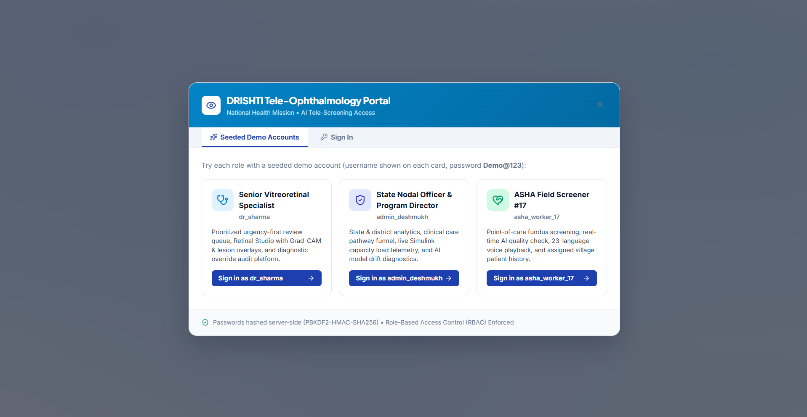
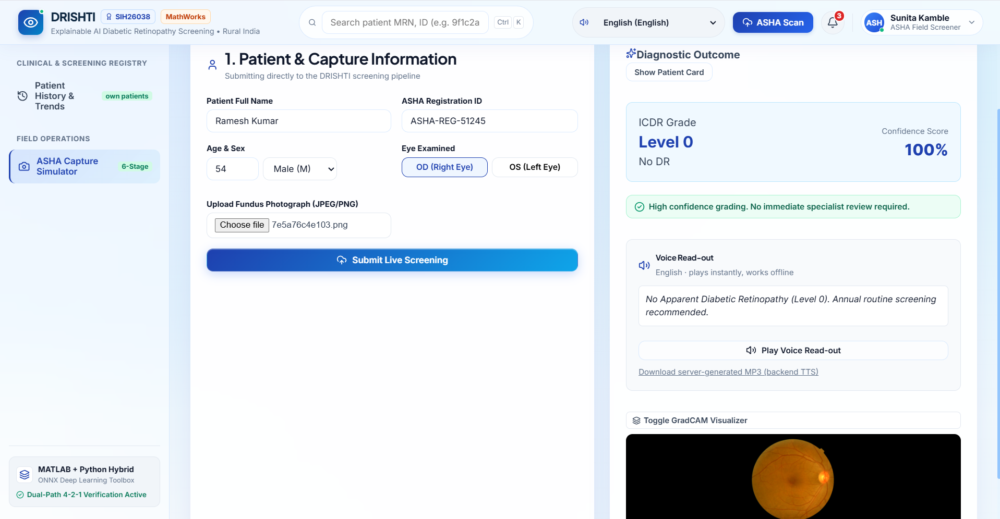
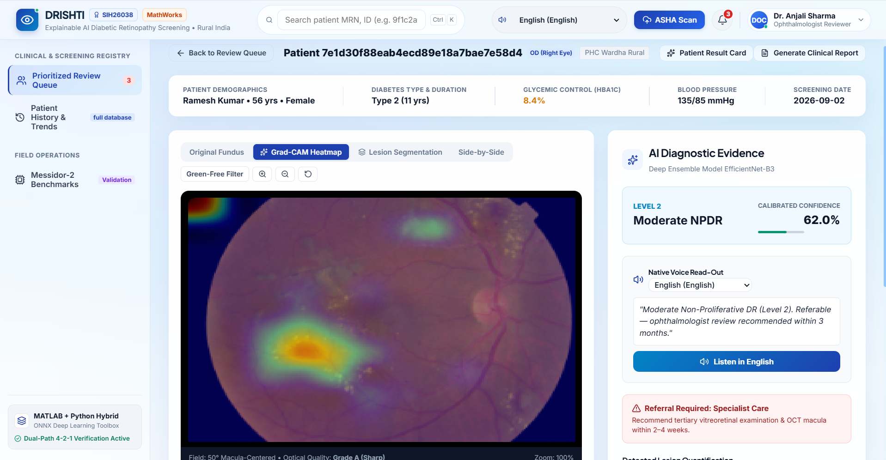
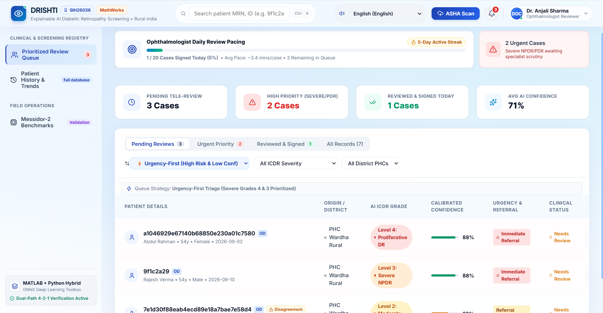
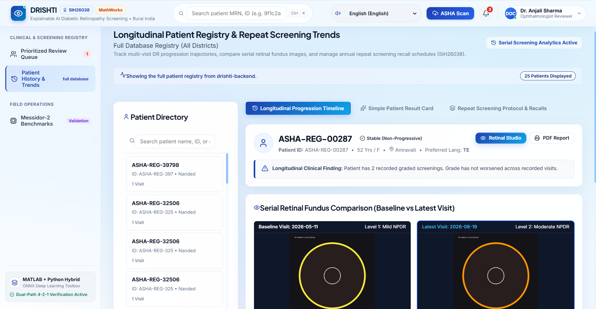
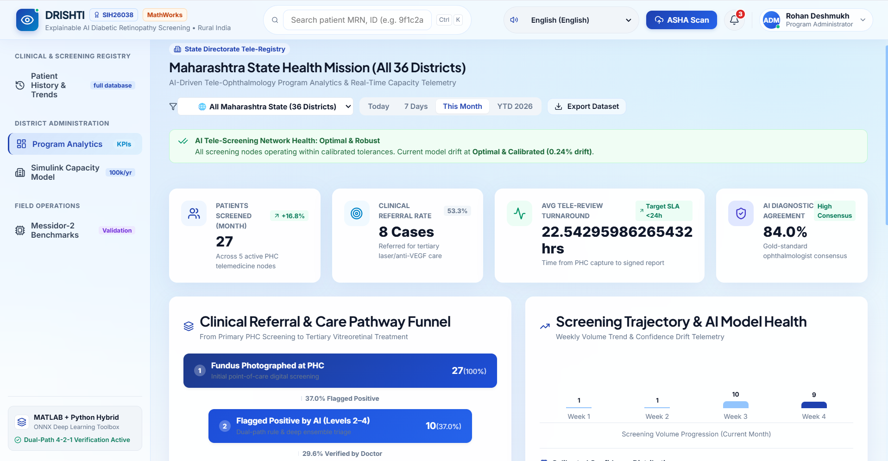
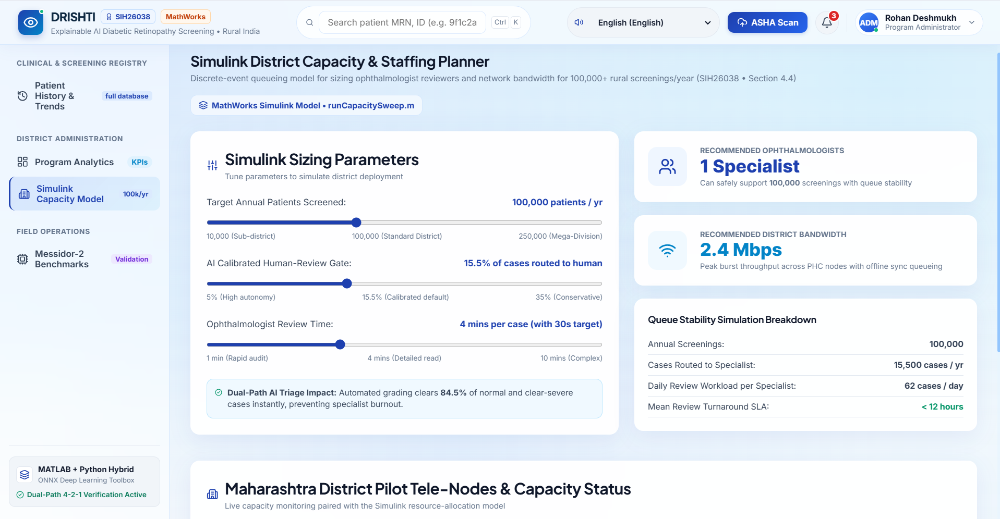
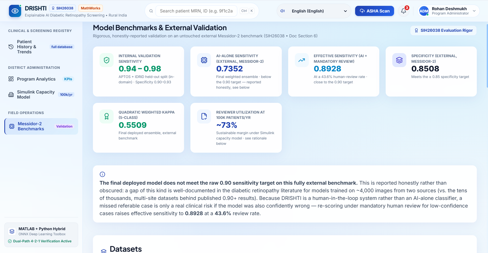

# DRISHTI — Explainable AI Diabetic Retinopathy Screening for Rural India

This repository is the working implementation for Smart India Hackathon
2026, Problem Statement SIH26038.

## 1. Project Information

- **Project Title:** DRISHTI — Explainable AI Diabetic Retinopathy Screening for Rural India
- **PS ID:** SIH26038
- **PS Title:** Explainable AI for Diabetic Retinopathy Screening in Rural India
- **Category:** Software
- **Theme:** MedTech / BioTech / HealthTech

## 2. Problem Statement

Diabetic retinopathy (DR) is a leading preventable cause of blindness in
India — an estimated 101M people live with diabetes nationally, of whom
roughly 12.5% develop DR, and about 4% (~4M people) have vision-threatening
DR. The bottleneck isn't disease incidence; it's screening capacity: too
few ophthalmologists relative to the population that needs annual fundus
screening, concentrated in urban centers far from the rural PHCs where
most at-risk patients actually live.

## 3. Proposed Solution

DRISHTI is a MATLAB + Python hybrid remote screening pipeline: an ASHA
worker captures a fundus photo at a rural PHC, the pipeline grades DR
severity end-to-end (image quality gating → adaptive enhancement → lesion
segmentation → dual-path ICDR severity grading → Grad-CAM explainability),
and low-confidence or referable cases are routed to an ophthalmologist for
tele-review — so a single reviewer can safely oversee screening at a scale
no manual-only process could sustain. Grading is **dual-path by design**:
an interpretable rule-based ICDR ("4-2-1") estimate runs alongside the
trained deep-learning ensemble, and a disagreement between the two is a 
visible review signal.

## 4. Key Features

- Fundus image quality gating with actionable recapture feedback
- Dual-path ICDR severity grading (rule-based **and** trained model,
  cross-checked — disagreement is a review signal, not hidden)
- Grad-CAM visual explainability + calibrated-confidence human review gating
- Prioritized ophthalmologist review queue with confirm/override, and a
  full audit trail of who reviewed what
- Longitudinal patient history and repeat-screening trajectory tracking
- Role-based accounts for all three real user types — ASHA field worker,
  ophthalmologist, and program administrator — each restricted to their
  own tabs and data, enforced on both the frontend and the backend API
- District-level program analytics and a Simulink-based capacity model for
  planning district-scale rollout
- Native-language voice read-out of results and PDF reports for
  ASHA-led rural patient communication
- Validated against Messidor-2, a fully external benchmark never trained
  or tuned on — see the in-app Benchmarks page for the actual numbers

## 5. Technology Stack

- **Frontend:** React, Vite
- **Backend:** Python, FastAPI
- **Machine Learning:** MATLAB (Image Processing / Computer Vision / Deep
  Learning Toolboxes, Simulink), PyTorch + timm (EfficientNet-B3, exported
  to ONNX and imported into MATLAB for inference and Grad-CAM)
- **Database:** PostgreSQL
- **Deployment:** Render (both backend and frontend), Neon (PostgreSQL),
  UptimeRobot (keeps the free backend from sleeping) —
  see `docs/DEPLOYMENT.md`

## 6. Architecture

See [docs/architecture.md](docs/architecture.md).

```text
ASHA Worker / Doctor / Admin
  |
  v
Frontend (React + Vite)
  |
  v
Backend API (FastAPI)
  |
  +----> PostgreSQL
  |
  v
MATLAB + Python ML Pipeline
  |
  v
Screening Result (grade, referral, heatmap, report, audio)
```

## 7. Repository Structure

```text
DRISHTI/
├── README.md
├── SUBMISSION_GUIDE.md
├── submission/
│   ├── PRESENTATION.md
│   └── DEMO.md
├── drishti-frontend/           # React + Vite web app (source code)
├── drishti-backend/            # FastAPI gateway + MATLAB/Python ML pipeline (source code)
│   ├── python/gateway/         # REST API, auth, database models
│   ├── matlab/                 # 6-stage screening pipeline
│   ├── scripts/                # demo data seeding
│   └── docs/api_contract.md    # full REST API reference
├── docs/
│   ├── architecture.md
│   ├── DEPLOYMENT.md           # free-tier live deployment guide
│   └── DEVELOPMENT_LOG.md      # detailed build/debugging history
├── assets/
│   └── screenshots/
├── render.yaml                 # backend deployment blueprint
├── requirements.txt
├── .gitignore
└── LICENSE
```

### What goes where?

| Item | Location |
|---|---|
| Frontend source code | `drishti-frontend/` |
| Backend + ML source code | `drishti-backend/` |
| Architecture / technical documentation | `docs/` |
| Project screenshots | `assets/screenshots/` |
| Final PPT / presentation | `submission/` |
| Demo video link | `submission/DEMO.md` |
| Project overview | `README.md` (this file) |

This repository uses `drishti-frontend/` and `drishti-backend/` instead of
a single `src/` folder because it's a two-service project rather than a
single script — see `docs/architecture.md` for why, and the note there
on why that's still consistent with this template's own structure guidance.

## 8. Final Presentation

See [submission/PRESENTATION.md](submission/PRESENTATION.md).

## 9. Demo Video

See [submission/DEMO.md](submission/DEMO.md).

## 10. Screenshots / Prototype Photos










## 11. Installation

Two services, installed independently.

**Backend** (`drishti-backend/python/gateway/`):
```bash
git clone <YOUR_REPOSITORY_URL>
cd DRISHTI/drishti-backend/python/gateway
pip install -r ../requirements-gateway.txt
```
`requirements-gateway.txt` includes `matlabengine`, which requires an
actual MATLAB installation matching its pinned version (see the comment
at the top of that file). To install without MATLAB (e.g. for the
deployed/demo configuration, or if you just want to run the backend in
its built-in mock-inference mode locally), use
`drishti-backend/requirements-deploy.txt` instead — it's the same
dependency set minus `matlabengine`, plus the PostgreSQL driver.

**Frontend** (`drishti-frontend/`):
```bash
cd DRISHTI/drishti-frontend
npm install
```

## 12. Run

**Backend** — set `DATABASE_URL` to your PostgreSQL connection string
first (see `docs/DEPLOYMENT.md` for a free Neon instance, or point at a
local PostgreSQL server), then, from `drishti-backend/python/gateway/`:
```bash
uvicorn main:app --reload
```
Seed three demo accounts (one per role) and demo patients so the app
isn't empty on first run — from `drishti-backend/`:
```bash
python scripts/seed_demo_patients.py
```
Sign in with `dr_sharma` / `admin_deshmukh` / `asha_worker_17`, password
`Demo@123` for all three.

**Frontend** — from `drishti-frontend/`:
```bash
npm run dev
```
Set `VITE_API_BASE_URL` in `drishti-frontend/.env` if the backend isn't
running on `http://localhost:8000`.

**Live deployment:** `<PASTE_YOUR_LIVE_DEPLOYMENT_URL_HERE_ONCE_DEPLOYED>`
— see `docs/DEPLOYMENT.md` for the full free-tier deployment walkthrough
(Neon + Render + UptimeRobot).

## 13. Future Scope

- Persistent object storage (e.g. Cloudflare R2) for generated report
  files, so they survive a redeploy on ephemeral hosting rather than only
  patient/screening data (already durable via PostgreSQL).
- Clinical vitals (HbA1c, blood pressure) captured at screening time
  aren't yet persisted server-side — currently collected in the UI but
  not sent to or stored by the backend.
- A capacity-planning API endpoint backed by the real Simulink model
  parameters, replacing the current simplified client-side estimate.
- Signed/expiring URLs for report files instead of the current
  session-token-in-query-param approach, for stronger access control on
  shared links.
- Native Android app for fully offline ASHA-side capture, syncing via the
  existing `/api/sync` batch endpoint.

## Important

Before submission, make sure the repository is accessible to reviewers.
Do **not** upload passwords, API keys, access tokens, `.env` files
containing secrets, real patient data, or other confidential credentials.
The three seeded demo account credentials above are intentionally public
and meant for reviewers — they are not a leaked secret.
